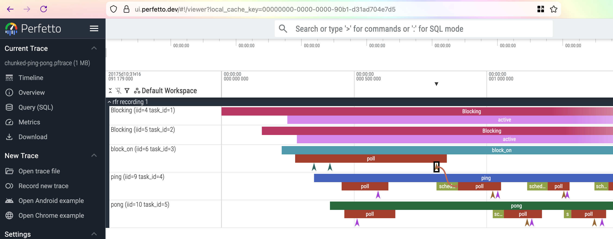

# Converting

There are other tools available for visualizing data similar to that collected by RFR. One of these
is [Perfetto].

[Perfetto]: https://perfetto.dev/

A good guide to getting started with this format an be found in the Perfetto documentation under
[Converting arbitrary timestamped data to Perfetto][converting-to-perfetto].

[converting-to-perfetto]: https://perfetto.dev/docs/getting-started/converting

## Build `rfr-convert`

You'll need to build `rfr-convert` from source. Check out the [`rfr` repository] from GitHub and
build the binary:

```sh
cargo build --release --bin rfr-convert
```

You will now find the binary in `target/release/rfr-convert`. You can also run it from cargo
directly:

```sh
cargo run --release --bin rfr-convert
```

The following examples will assume you have `rfr-convert` in your path (e.g. `$PATH` environment
variable).

[`rfr` repository]: https://github.com/hds/rfr


## Converting to Perfetto Trace Format

It is possible to convert a chunked flight recording to Perfetto trace format.

To do so, run the following command:

```sh
rfr-convert --format perfetto my-app-run-42.rfr
```

This will give you a file called `my-app-run-42.pftrace`. That file can be opened in the [Perfetto
Trace Viewer][trace-viewer].

[trace-viewer]: https://ui.perfetto.dev/



One difference compared to the [visualizations](visualizing.md) created by `rfr-viz` is that lines
indicating spawning and waking are only shown when one side of the flow (as these are called in
Perfetto) is highlighted. In the screenshot above the `block_on` task waking the `ping` task is
visible.
