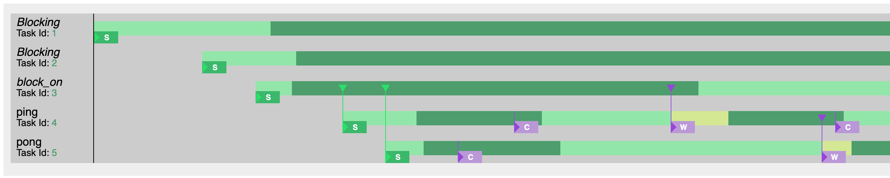
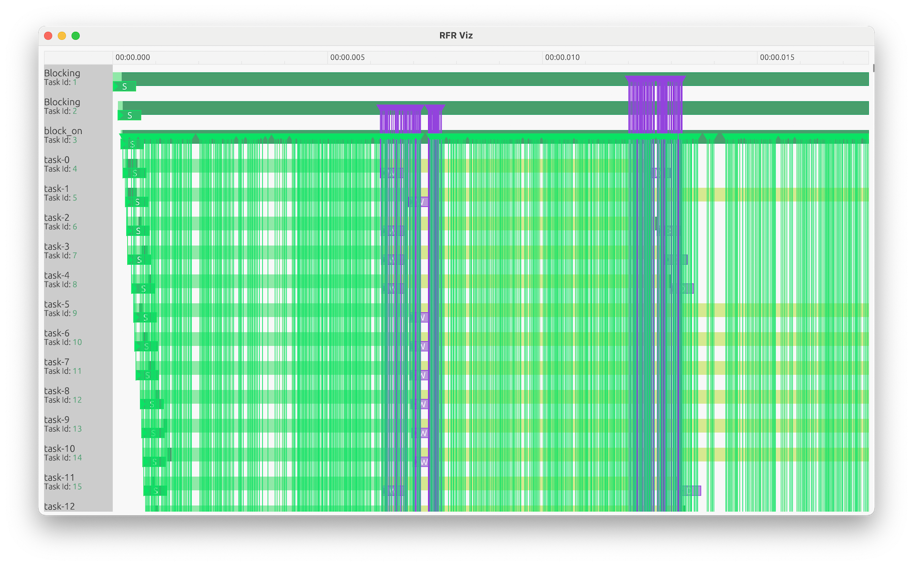

# Visualizing

Once you have a flight recording, the `rfr-viz` crate can be used to visualize the contents
directly. These tools are still very much a work in progress, so you might be better off
[converting] the flight recording to Perfetto Trace format and using the [Perfetto Trace Viewer].

[converting]: converting.md
[Perfetto Trace Viewer]: https://ui.perfetto.dev

## Build `rfr-viz`

You'll need to build `rfr-viz` from source. Check out the [`rfr` repository] from GitHub and build
the binary:

```sh
cargo build --release --bin rfr-viz
```

You will now find the binary in `target/release/rfr-viz`. You can also run it from cargo directly:

```sh
cargo run --release --bin rfr-viz
```

The following examples will assume you have `rfr-viz` in your path (e.g. `$PATH` environment
variable).

[`rfr` repository]: https://github.com/hds/rfr

## Generate HTML visualization

To generate a static HTML file containing a visualization of a flight recording `my-app-run-42.rfr`, run
the following command:

```sh
rfr-viz generate --name my-app my-app-run-42.rfr
```

This will produce an output file `my-app.html` (taken from the name, not the input file).

For a simple program, that could look something like this:



## Interactive UI

There is also an interactive UI which can open flight recordings and allow you to scroll around and
hover over elements.

To start the UI, use the `ui` subcommand in `rfr-viz`:

```sh
rfr-viz ui my-app-run-42.rfr
```

For the same simple program, the UI looks like this:


The timeline can be zoomed in and our with the `=` (zoom in) and `-` (zoom out) keys. Zooming out
allows much more time to be seen, but it can be a little overwhelming.

This is visualizing a (still quite simple) program that creates 1000 tasks:



This can be a bit too much information to handle at this level!
